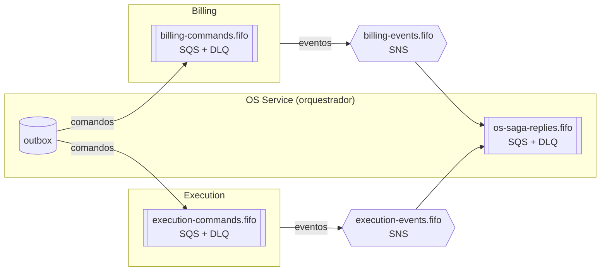

# Catálogo de mensagens — v1 (Fase 4)

> Escrito no B0 (2026-10-01), revisado pelo dono em 2026-10-05.
> Estados citados aqui: [máquina de estados v2](maquina-de-estados.md).

A saga é **orquestrada** pelo OS Service. Por isso existem dois tipos de mensagem, com nomes e canais
diferentes:

- **Comando**: pedido do orquestrador a **um** participante, no imperativo (`CreateBudget`). Vai **direto
  para a fila de comandos** do participante (ponto a ponto).
- **Evento**: fato que um participante **já registrou**, no passado (`BudgetCreated`). É publicado no **tópico
  do participante**, e quem tiver interesse assina (pub/sub).

---

## 1. Topologia



| Recurso | Tipo | Dono (Terraform) | Quem escreve | Quem lê |
|---|---|---|---|---|
| `execution-commands.fifo` | SQS FIFO + DLQ | repo do Execution | OS (outbox) | Execution |
| `billing-commands.fifo` | SQS FIFO + DLQ | repo do Billing | OS (outbox) | Billing |
| `execution-events.fifo` | SNS FIFO | plataforma | Execution (outbox) | `os-saga-replies.fifo` |
| `billing-events.fifo` | SNS FIFO | plataforma | Billing (outbox) | `os-saga-replies.fifo` |
| `os-saga-replies.fifo` | SQS FIFO + DLQ, assinando os dois tópicos (*raw delivery*) | repo do OS | SNS | OS (orquestrador) |

- **Nenhum `os-events` no v1.** Hoje nenhum serviço consumiria eventos do OS — o orquestrador fala por
  comandos. O tópico nasce quando houver o primeiro consumidor real (por exemplo, notificações).
- Quem é dono do quê segue a regra de divisão da infra: o tópico (contrato público) fica na plataforma; a fila
  fica com quem a consome.

---

## 2. Envelope (toda mensagem)

**Corpo (JSON):**

```json
{
  "messageId": "0b8f1c2e-…",
  "type": "BudgetCreated",
  "version": 1,
  "occurredAt": "2026-10-20T14:03:11.482Z",
  "sagaId": "6f1d…",
  "workOrderId": 42,
  "branchId": "SP-01",
  "correlationId": "EVIDENCIA-B7-001",
  "causationId": "c41a…",
  "payload": { }
}
```

| Campo | Regra |
|---|---|
| `messageId` | UUID gerado **no outbox**; é a chave de idempotência (inbox) e o `MessageDeduplicationId` da FIFO |
| `type` + `version` | identificam o contrato; o consumidor ignora (e registra) tipo desconhecido |
| `sagaId` | id da `saga_instance`; vai para o MDC do log |
| `workOrderId` | é o `MessageGroupId` da FIFO → **ordem garantida por OS** |
| `branchId` | filial da OS; o Execution usa para montar a **fila por filial**, e os dashboards filtram por ela |
| `correlationId` | o `X-Trace-Id` da requisição de origem — o mesmo campo que já atravessava Gateway → app → New Relic na Fase 3 |
| `causationId` | `messageId` da mensagem que causou esta; permite reconstruir a cadeia |

**Message attributes** (limite de **10** por mensagem no SNS/SQS): `type`, `version`, `sagaId`,
`correlationId`, mais os headers de trace distribuído (`traceparent`, `tracestate`, `newrelic`). São **7**,
dentro do limite. *Message attributes* publicados no SNS chegam intactos ao SQS com *raw delivery* — provado no
spike de 2026-09-29.

**Evolução de contrato:** mudança **aditiva** (campo novo opcional) mantém a `version`, e o consumidor é
*tolerant reader*. Mudança **quebrando** contrato cria `version: 2`, e as duas versões convivem até todos os
consumidores migrarem. Nunca se reaproveita um `type`.

---

## 3. Comandos (OS → participante)

| Comando | Para | Payload principal | Responde com | É compensação de |
|---|---|---|---|---|
| `StartDiagnosis` | Execution | `vehiclePlate`, `complaint` (relato da abertura) | `DiagnosisStarted` (quando o mecânico começa); depois `DiagnosisCompleted` ou `DiagnosisFailed` | — |
| `CancelDiagnosis` | Execution | `reason` | `DiagnosisCanceled` | diagnóstico |
| `CreateBudget` | Billing | `customerDocument`, `items[{type, catalogId, description, quantity, unitPrice}]`, `total`, `approvalDeadline` | `BudgetCreated` ou `BudgetCreationFailed` | — |
| `CancelBudget` | Billing | `budgetId`, `reason` | `BudgetCanceled` | orçamento |
| `RequestPayment` | Billing | `budgetId`, `amount`, `paymentDeadline` | `PaymentRequested` ou `PaymentRequestFailed` | — |
| `CancelPayment` | Billing | `budgetId`, `reason` | `PaymentCanceled` | cobrança pendente |
| `RefundPayment` | Billing | `paymentId`, `reason` | `PaymentRefunded` | cobrança confirmada |
| `StartRepair` | Execution | `items` (o snapshot precificado) | `RepairStarted` (quando o mecânico começa); depois `RepairCompleted` ou `RepairFailed` | — |

- **Todo comando de avanço tem uma resposta de falha** (`DiagnosisFailed`, `BudgetCreationFailed`, `PaymentRequestFailed`, `RepairFailed`), para que **qualquer etapa** possa disparar a compensação, como o edital exige. Falha **transitória** (serviço fora do ar) não é resposta de falha: a mensagem espera na fila e vai para a DLQ se esgotar.
- **Todo comando é idempotente pela chave de negócio** (ex.: um único orçamento por `workOrderId`). Receber o
  mesmo comando duas vezes devolve o mesmo resultado.
- **Toda compensação responde com um evento.** O orquestrador só marca a saga como `COMPENSATED` quando todas
  as confirmações chegaram.
- **Compensação é retentável, nunca "desistível".** Se o estorno falhar, ele é retentado (com a mesma
  idempotency key no Mercado Pago); se esgotar, vai para a DLQ com alerta e runbook — a saga fica em
  `COMPENSATING`, visível, até resolver.

## 4. Eventos (participante → OS)

| Evento | De | Payload principal | Efeito no orquestrador |
|---|---|---|---|
| `DiagnosisStarted` | Execution | `mechanic`, `startedAt` | OS → `UNDER_DIAGNOSIS` |
| `DiagnosisCompleted` | Execution | `description`, `items[{type, catalogId, quantity}]` | precifica pelo catálogo (local) → `CreateBudget` |
| `DiagnosisFailed` | Execution | `reason` (ex.: veículo sem reparo viável) | compensa: cancela OS (motivo `DIAGNOSIS_FAILED`) |
| `DiagnosisCanceled` | Execution | — | confirma a compensação |
| `RepairStarted` | Execution | `startedAt` | — (OS já está `IN_PROGRESS`) |
| `RepairCompleted` | Execution | `completedAt` | **pivô** → OS `COMPLETED`, notifica o cliente |
| `RepairFailed` | Execution | `reason` | compensa: estorno → devolve peças → cancela orçamento → cancela OS |
| `BudgetCreated` | Billing | `budgetId`, `total` | OS → `PENDING_APPROVAL`, abre o prazo de aprovação |
| `BudgetCreationFailed` | Billing | `reason` (regra de negócio violada) | compensa: `CancelDiagnosis` → cancela OS (motivo `BUDGET_CREATION_FAILED`) |
| `BudgetApproved` | Billing | `budgetId`, `approvedBy` (cpf) | reserva peças (local) → `RequestPayment` |
| `BudgetRejected` | Billing | `budgetId` | compensa (motivo `REJECTED_BY_CUSTOMER`) |
| `BudgetCanceled` | Billing | `budgetId` | confirma a compensação |
| `PaymentRequested` | Billing | `budgetId`, `paymentLink` (`init_point`), `preferenceId` | abre o prazo de pagamento |
| `PaymentRequestFailed` | Billing | `reason` (5xx do MP esgotado) | compensa (motivo `PAYMENT_REQUEST_FAILED`) |
| `PaymentAttemptRejected` | Billing | `statusDetail` (ex.: saldo insuficiente) | **informativo** — registra no histórico e segue esperando até o prazo |
| `PaymentConfirmed` | Billing | `paymentId`, `amount` | baixa peças (local) → `StartRepair`; se a saga já compensou → `RefundPayment` (estorno automático) |
| `PaymentCanceled` | Billing | `budgetId` | confirma a compensação |
| `PaymentRefunded` | Billing | `paymentId`, `refundId` | confirma a compensação |

## 5. Passos locais do orquestrador (sem mensagem)

Acontecem no OS Service, **na mesma transação** que avança a saga e grava o próximo comando no outbox:
precificar os itens do diagnóstico pelo catálogo (o preço fica **congelado** no snapshot) · reservar peças ·
baixar as reservadas · liberar reserva · devolver ao estoque · projetar o status da OS e gravar o histórico.

## 6. Chamadas síncronas (REST) — onde e por quê

O padrão entre serviços é assíncrono. Cada chamada síncrona abaixo tem um motivo explícito:

| Quem chama | Quem responde | Para quê | Por que síncrono | Proteções |
|---|---|---|---|---|
| Execution | OS (catálogo, leitura) | validar os itens no momento em que o mecânico conclui o diagnóstico | é **feedback a um humano**: item inválido precisa voltar como 400 na hora, não minutos depois | timeout curto + circuit breaker; OS fora do ar → **503** claro ao mecânico e nada muda no processo. Proposta a validar no B6: repassar o JWT do mecânico (*token relay*), sem credencial nova |
| Lambda de auth | OS (endpoint interno) | saber se o CPF é cliente, sem ler o banco do OS | é o próprio passo de autenticação | fora da allowlist do Gateway + autenticação de serviço na app |
| Clientes | serviços, via Gateway | consultas e ações de pessoas (abrir OS, aprovar, acompanhar) | interação humana | JWT + allowlist de rotas no Gateway |

Nenhum serviço lê o banco de outro: o Execution pergunta ao OS pela API, e a Lambda também.
