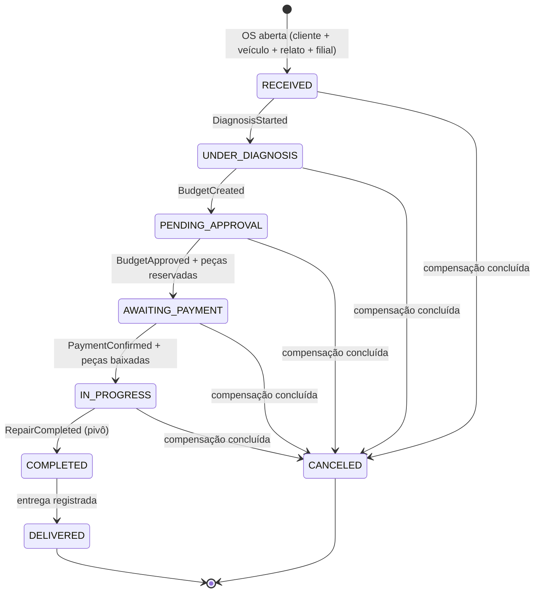
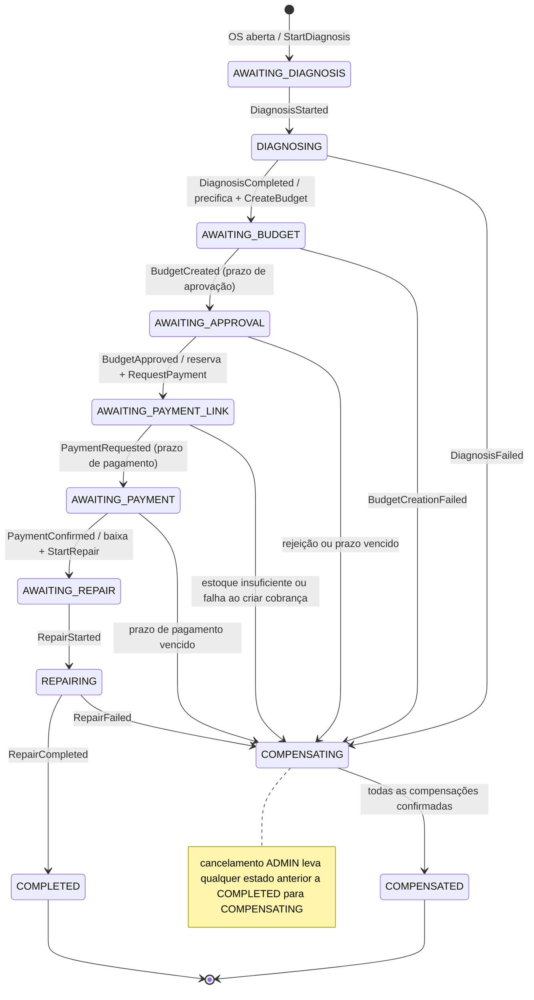
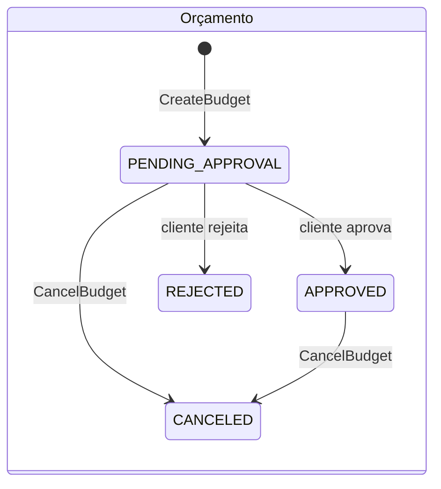
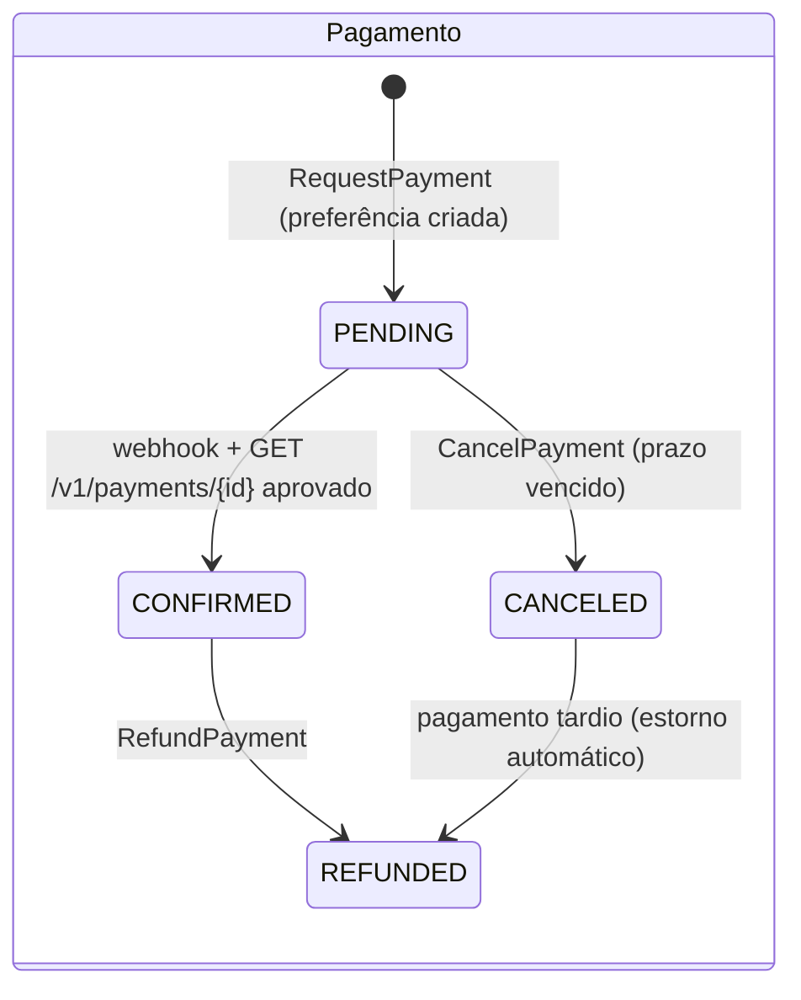
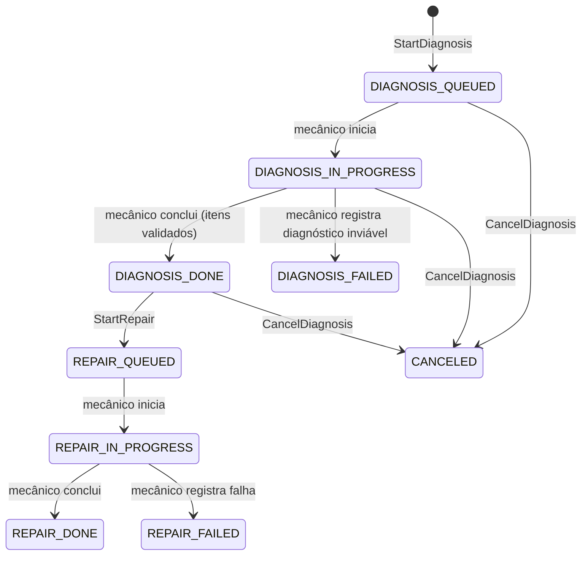

# Máquina de estados da Ordem de Serviço — v2 (Fase 4)

> Escrito no B0 (2026-10-01), revisado pelo dono em 2026-10-05.
> Complementa o [catálogo de eventos v1](catalogo-de-mensagens.md), a
> [matriz de compensação](matriz-de-compensacao.md) e o [ADR da Saga](adr/ADR-001-saga-orquestrada.md).

Na Fase 4 existem **três máquinas de estado** diferentes, e misturá-las é a forma mais rápida de errar:

| Máquina | Onde vive | Para quem é |
|---|---|---|
| **Status da OS** | OS Service (Postgres, tabela `work_orders`) | Cliente e atendimento: é o que `/tracking` e o histórico mostram |
| **Estado da saga** | OS Service (Postgres, tabela `saga_instance`) | O orquestrador: em que passo do processo distribuído a OS está e o que falta compensar |
| **Estados locais dos participantes** | Billing (Postgres) e Execution (DynamoDB) | Cada serviço, para garantir as próprias regras (*semantic lock*) |

O status da OS é uma **projeção** do processo: muda quando a saga confirma um fato, nunca antes.

---

## 1. Status da OS (visível ao cliente)

Mudança em relação à Fase 3: entra **um** status novo, `AWAITING_PAYMENT`. Os demais já existiam no enum
`StatusWO`, então os dashboards por status da Fase 3 continuam válidos.



| Status | Significado | Entra quando |
|---|---|---|
| `RECEIVED` | OS aberta, aguardando o diagnóstico começar | abertura (cliente, veículo, relato do problema e filial) |
| `UNDER_DIAGNOSIS` | Mecânico diagnosticando | evento `DiagnosisStarted` |
| `PENDING_APPROVAL` | Orçamento enviado, aguardando o cliente | evento `BudgetCreated` |
| `AWAITING_PAYMENT` | Aprovado, peças reservadas, link de pagamento disponível | `BudgetApproved` + reserva local bem-sucedida |
| `IN_PROGRESS` | Pago, peças baixadas, reparo na fila ou em execução | `PaymentConfirmed` + baixa local |
| `COMPLETED` | Reparo concluído — **ponto sem volta** | evento `RepairCompleted` |
| `DELIVERED` | Veículo entregue | ação do atendimento (ADMIN) |
| `CANCELED` | Processo desfeito **e todas as compensações confirmadas** | saga chega a `COMPENSATED` |

- `CANCELED` só aparece **depois** que todas as compensações foram confirmadas. Enquanto a saga compensa, a OS
  mantém o status anterior e o estado da saga mostra `COMPENSATING`. Assim, o cliente nunca vê "cancelado"
  com o dinheiro ainda retido.
- Toda OS cancelada guarda um **motivo**: `REJECTED_BY_CUSTOMER`, `APPROVAL_EXPIRED`, `OUT_OF_STOCK`,
  `PAYMENT_EXPIRED`, `PAYMENT_REQUEST_FAILED`, `REPAIR_FAILED`, `DIAGNOSIS_FAILED`, `BUDGET_CREATION_FAILED` ou `CANCELED_BY_STAFF` (cancelamento pelo atendimento, permitido em qualquer estado antes do pivô).
- Toda transição grava uma linha em `work_order_status_history` (status, instante, motivo, `sagaId`). É o que
  atende "consulta de status e histórico" do edital e fecha a lacuna da Fase 3, que só tinha criação e fim.

---

## 2. Estado da saga (orquestrador, dentro do OS Service)

Persistido em `saga_instance` (uma por OS) com **controle de versão otimista** (`@Version`): o *scheduler* de
prazos e o consumidor de mensagens podem tentar mexer na mesma saga ao mesmo tempo, e só um vence. O outro
relê o estado e decide de novo.



**Transições atômicas locais.** Os passos que acontecem **dentro** do OS Service — precificar os itens,
reservar, baixar, liberar ou devolver peças — não viram mensagem. Eles acontecem **na mesma transação
Postgres** que avança a saga e grava o próximo comando no outbox. Exemplo, ao receber `BudgetApproved`:

```
BEGIN
  reservar as peças do orçamento                  -- falhou? → estado COMPENSATING + outbox CancelBudget
  saga_instance: AWAITING_APPROVAL → AWAITING_PAYMENT_LINK (version + 1)
  work_orders: PENDING_APPROVAL → AWAITING_PAYMENT  (+ linha no histórico)
  outbox: RequestPayment
  inbox: registrar o messageId de BudgetApproved
COMMIT
```

Ou acontece tudo ou nada acontece. É o ACID local que sustenta cada passo da saga.

**Prazos** (configuráveis por variável de ambiente; demo = 2 min):

| Estado | Prazo padrão | Ao vencer |
|---|---|---|
| `AWAITING_APPROVAL` | 48 h | compensa com motivo `APPROVAL_EXPIRED` |
| `AWAITING_PAYMENT` | 30 min | compensa com motivo `PAYMENT_EXPIRED` (tentativas recusadas ficam registradas, mas não encerram a espera) |

O *scheduler* de prazos busca as sagas vencidas com `FOR UPDATE SKIP LOCKED`, para que várias réplicas não
compensem a mesma saga duas vezes. Esperas sem prazo de negócio (diagnóstico, que depende do mecânico, e
respostas de serviços fora do ar) **não compensam sozinhas**: geram alerta de "saga parada" na observabilidade.

**Etapas pela classificação de Garcia-Molina / Richardson:**

| Tipo | Etapas |
|---|---|
| Compensáveis | abrir OS · diagnóstico · orçamento · reserva · cobrança · baixa de peças · reparo em andamento |
| **Pivô** | reparo concluído (`RepairCompleted`) |
| Retentáveis | notificar o cliente · registrar a entrega |

---

## 3. Estados locais dos participantes

### Billing (Postgres)





- *Semantic lock*: aprovar exige `PENDING_APPROVAL`; um orçamento `CANCELED` responde **409** à aprovação
  tardia.
- Tentativas recusadas (`rejected` no Mercado Pago) viram linhas em `payment_attempts` e o evento informativo
  `PaymentAttemptRejected`. **Não** mudam o estado do pagamento.

### Execution (DynamoDB — item `STATE` da OS)



Cada transição é um `UpdateItem` condicional (`ConditionExpression` no estado atual) no **mesmo**
`TransactWriteItems` que grava o item de outbox — o padrão provado no spike de 2026-09-29.

---

## O que mudou em relação à Fase 3

| Fase 3 | Fase 4 |
|---|---|
| Itens escolhidos na abertura | Itens definidos **no diagnóstico** e validados no catálogo do OS por REST síncrono |
| `DiagnosisSchedulerService` move `RECEIVED → UNDER_DIAGNOSIS` a cada 10 s | Diagnóstico é uma fila no Execution; o status muda pelo evento `DiagnosisStarted` |
| `completeDiagnosis` gera o orçamento na mesma chamada | Diagnóstico (Execution) e orçamento (Billing) são etapas separadas, ligadas pelo orquestrador |
| Aprovação em `/tracking/{id}/approve`, com baixa de estoque na mesma transação | Aprovação no Billing; reserva na aprovação, baixa no pagamento confirmado |
| Sem pagamento | Checkout Pro do Mercado Pago, com estorno como compensação |
| Histórico só com criação e fim | `work_order_status_history` com cada transição, motivo e `sagaId` |
